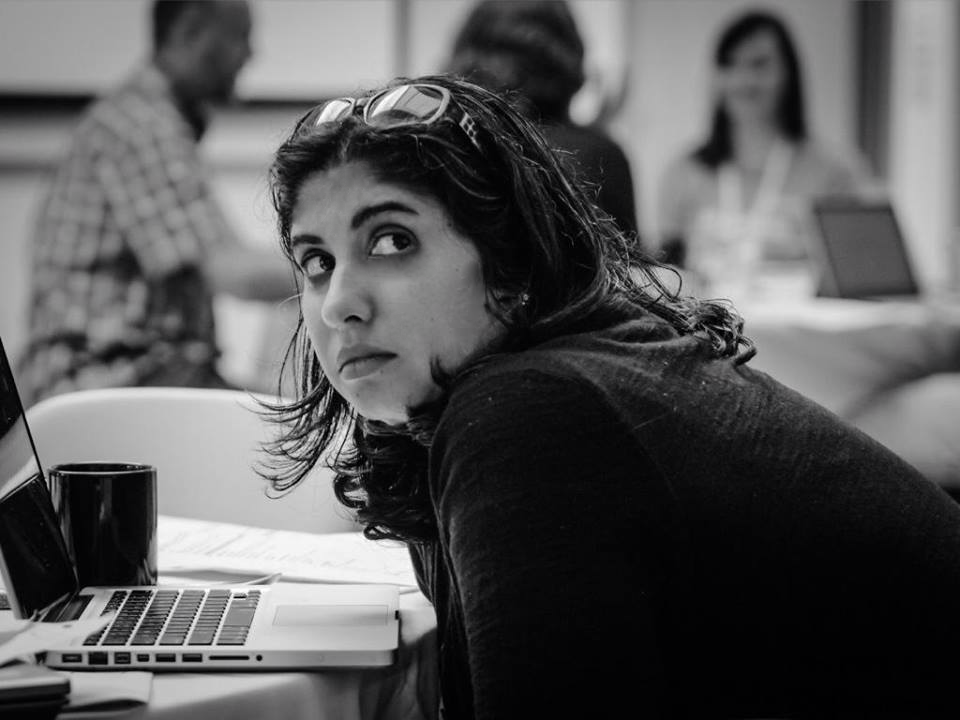

{: .center-image }
*[Pittsburgh Skyline Silhouette by Patrick Reddick](https://flic.kr/p/b3G3NR) [CC-BY-2.0](https://creativecommons.org/licenses/by/2.0/)*

The Keystone Digital Humanities Conference will be held at the University of Pittsburgh on June 22-24, 2016.

---

{: .flush-left}

### We are honored to announce that **Roopika Risam** will be delivering the keynote presentation, entitled, *"Only Collaborate! Postcolonial Imperatives for Community in the Digital Humanities."*

---

Registration is now open!

## ***[CLICK HERE TO REGISTER!](https://www.regonline.com/keystoneDH2016)***

---

On Twitter? Follow the Keystone DH hashtag [#keydh](https://twitter.com/search?f=tweets&vertical=default&q=%23keydh&src=typd)

### Digital Mitford Coding School

We invite you to join members of the Digital Mitford project team from Saturday June 25 through Monday June 27, 2016 for the Fourth Annual Workshop Series and Coding School, hosted by the newly established Center for the Digital Text at the University of Pittsburgh at Greensburg.

[Please visit the Digital Mitford page for more information.](https://digitalmitford.wordpress.com/2016/02/29/digital-mitford-coding-school-june-25-27-2016/)

### Conference Organizing Committee

- Elisa Beshero-Bondar, University of Pittsburgh at Greensburg
- Matt Burton, University of Pittsburgh
- Patricia Hswe, Penn State University
- Diane Jakacki, Bucknell University
- Patrick Juola, Duquesne University
- Delphine Khanna, Temple University
- Alison Langmead, University of Pittsburgh
- Matt Lavin, University of Pittsburgh
- Tom Lombardi, Washington & Jefferson College
- Cathleen Lu, Chemical Heritage Foundation
- Aaron Mauro, Penn State University
- Elaine Parsons, Duquesne University
- Dot Porter, University of Pennsylvania
- Matthew Shoemaker, Temple University
- Sandra Stelts, Penn State University
- Scott Weingart, Carnegie Mellon University

KeystoneDH is committed to advancing collaborative scholarship in the Digital Humanities among Pennsylvania-based institutions of Higher Education. Our goal is to encourage community and collaboration among Pennsylvania-based institutions of higher education engaged in Digital Humanities Research or Pedagogy. We invite schools and constituents within schools to participate across traditional “peer institution” or categorical divide, as well as across faculty, staff, and students (undergraduate and graduate) as well as independent scholars.
