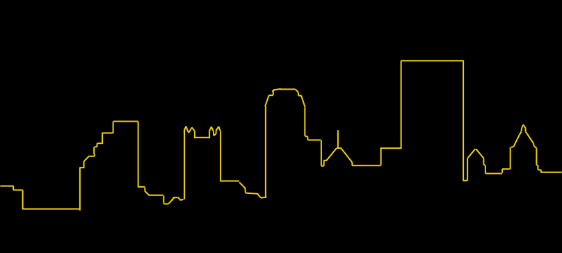

{: .center-image }
*[Pittsburgh Skyline Silhouette by Patrick Reddick](https://flic.kr/p/b3G3NR) [CC-BY-2.0](https://creativecommons.org/licenses/by/2.0/)*

The Keystone Digital Humanities Conference will be held at the University of Pittsburgh on June 22-24, 2016.

**Please see the CFP and submit your proposals [here](http://keystonedh.github.io/2016/cfp/). The proposals/abstracts are due February 1, 2016.**

The program will consist of long presentations (20 minutes), short presentations (7 minutes), project showcases (10 minutes) and workshops (various lengths) in all areas of digital humanities. Presentations may take the form of interactive presentations, short papers, project demos, panel discussions or workshops. Presenters will include emerging and veteran students, teachers, and scholars.

On Twitter? Follow the Keystone DH hashtag [#keydh](https://twitter.com/search?f=tweets&vertical=default&q=%23keydh&src=typd)

### Conference Organizing Committee

- Elisa Beshero-Bondar, University of Pittsburgh at Greensburg
- Matt Burton, University of Pittsburgh
- Patricia Hswe, Penn State University
- Diane Jakacki, Bucknell University
- Patrick Juola, Duquesne University
- Delphine Khanna, Temple University
- Alison Langmead, University of Pittsburgh
- Matt Lavin, University of Pittsburgh
- Tom Lombardi, Washington & Jefferson College
- Cathleen Lu, Chemical Heritage Foundation
- Aaron Mauro, Penn State University
- Elaine Parsons, Duquesne University
- Dot Porter, University of Pennsylvania
- Matthew Shoemaker, Temple University
- Sandra Stelts, Penn State University
- Scott Weingart, Carnegie Mellon University
